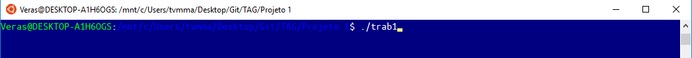

# Projeto 1

## Tutorial

1 - Baixar esta pasta

2 - Executar no terminal ./trab1

3 - Escolher o arquivo gml que o grafo está estruturado. Nesta pasta já possui 3 arquivos exemplo : friends, friends2 e karate.

4 - O programa irá criar um arquivo chamado out.html que serve para visualizar o grafo

