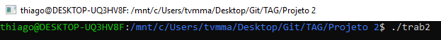

# Projeto 1

## Tutorial

1 - Baixar esta pasta

2 - Executar no terminal ./trab2

3 - Escolher o arquivo txt que o grafo está estruturado. Nesta pasta já possui 3 arquivos exemplo : top_small.txt, top_med.txt, top_large.txt e top_huge.txt .

4 - O programa irá rodar apenas no terminal indicando o tempo para executar os algoritmos de ordenação topológica e os vértices já ordenados

5 - OBS: Unico programa que demora mais que 0 segundos é o arquivo top_huge.txt, para ver seu tempo, basta colocar em comentário a linha 194

6 - Compilar o programa

7 - Executar o passo 2